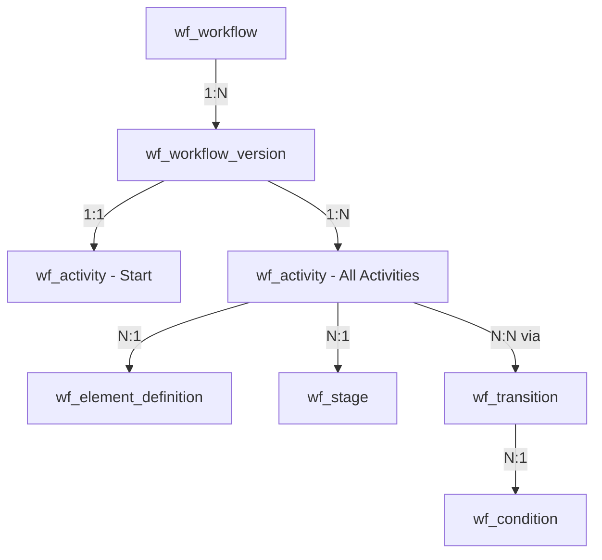

# ServiceNow Workflow Creation Guide

**Last Updated:** 2025-09-29
**Status:** ✅ FEASIBLE - Programmatic workflow creation is possible!

---

## 🎉 Key Discovery

After analyzing real workflows in your instance, **programmatic workflow creation IS achievable!**

The secret: Activities store their logic in the `input` field as JavaScript code. We can create workflows by:
1. Creating workflow structure (tables)
2. Creating activities with embedded scripts
3. Linking them with transitions
4. Publishing the version

---

## Table Architecture

### Core Tables

```
wf_workflow (base definition)
├── wf_workflow_version (published versions)
    ├── wf_activity (activities with scripts)
    │   ├── wf_element_definition (activity types)
    │   └── wf_stage (optional stages)
    ├── wf_transition (connects activities)
    │   └── wf_condition (transition logic)
    └── wf_condition (workflow-level conditions)
```

### Relationships



---

## Real Workflow Example Analysis

From your instance: "API Access Fulfillment - Production"

### Structure

```
Start Activity: "Evaluate Request"
    ↓ (if tier=1)
  "Auto Approve Tier 1"
    ↓ (approved)
  "Create API Subscription"
    ↓
  "Send Confirmation Email"

    ↓ (if tier>1)
  "Manager Approval Required"
    ↓ (approved)
  "Create API Subscription"
    ↓
  "Send Confirmation Email"
```

### Activities with Scripts

**Activity 1: Start - Evaluate Request**
```javascript
// Position: x=100, y=100
// Input script:
var request = current;
var tier = request.u_data_tier || '1';
workflow.scratchpad.data_tier = tier;
workflow.scratchpad.requires_approval = (tier > 1);
```

**Activity 2: Auto Approve Tier 1**
```javascript
// Position: x=200, y=200
// Input script:
if (workflow.scratchpad.data_tier == '1') {
  current.state = 'approved';
  current.approval = 'approved';
  current.update();
  answer = 'approved';
} else {
  answer = 'requires_manager_approval';
}
```

**Activity 3: Create API Subscription**
```javascript
// Position: x=300, y=250
// Input script:
var subscription = new GlideRecord('u_api_subscription');
subscription.initialize();
subscription.u_requester = current.opened_by;
subscription.u_api_name = current.u_api_name;
subscription.u_data_tier = workflow.scratchpad.data_tier;
subscription.u_status = 'active';
subscription.u_request_id = current.sys_id;
var subscriptionId = subscription.insert();
workflow.scratchpad.subscription_id = subscriptionId;
```

---

## Field Specifications

### wf_workflow

| Field | Type | Required | Description |
|-------|------|----------|-------------|
| sys_id | GUID | Auto | System ID |
| name | string(100) | Yes | Workflow name (read-only after creation) |
| table | table_name(80) | No | Target table (read-only after creation) |
| description | string(4000) | No | Description |
| template | boolean | No | Is template workflow |
| access | string(40) | No | Accessibility (default: "public") |

**Note:** `name` and `table` become read-only after creation!

### wf_workflow_version

| Field | Type | Required | Description |
|-------|------|----------|-------------|
| sys_id | GUID | Auto | System ID |
| name | string(100) | Yes | Version name |
| workflow | reference | No | Parent workflow sys_id |
| table | table_name(80) | **Yes** | Target table |
| start | reference | No | Starting activity sys_id |
| active | boolean | No | Is active (default: true) |
| published | boolean | No | Is published (default: false) |
| condition | conditions | No | Trigger condition |
| order | integer | No | Execution order (default: 100) |
| run_multiple | boolean | No | Allow multiple instances |
| after_business_rules | boolean | No | Run after business rules |
| expected_time | glide_duration | No | Expected completion time |
| condition_type | string(40) | No | Condition matching type |

### wf_activity

| Field | Type | Required | Description |
|-------|------|----------|-------------|
| sys_id | GUID | Auto | System ID |
| name | string(100) | No | Activity name |
| workflow_version | reference | No | Parent workflow version sys_id |
| activity_definition | reference | No | Activity type sys_id |
| x | integer | No | X coordinate on canvas |
| y | integer | No | Y coordinate on canvas |
| width | integer | No | Width on canvas |
| height | integer | No | Height on canvas |
| **input** | **data_object(65000)** | **No** | **JavaScript code/config!** |
| vars | glide_var | No | Activity variables |
| stage | reference | No | Stage sys_id |
| parent | reference | No | Parent activity sys_id |
| timeout | glide_duration | No | Timeout duration |

**KEY:** The `input` field holds the JavaScript that executes!

### wf_transition

| Field | Type | Required | Description |
|-------|------|----------|-------------|
| sys_id | GUID | Auto | System ID |
| from | reference | No | From activity sys_id |
| to | reference | No | To activity sys_id |
| condition | reference | No | Condition sys_id |
| order | integer | No | Order of execution |

### wf_condition

| Field | Type | Required | Description |
|-------|------|----------|-------------|
| sys_id | GUID | Auto | System ID |
| activity | reference | No | Parent activity sys_id |
| name | string(100) | No | Condition name |
| condition | condition_string(254) | No | Condition logic |
| short_description | string(100) | No | Description |
| order | integer | No | Order (default: 1) |
| else_flag | boolean | No | Is default/else condition |
| event | boolean | No | Is event-based |
| event_name | string(40) | No | Event name if event-based |
| condition_type | string(40) | No | Type (default: "standard") |

---

## Activity Types (wf_element_definition)

Available activity types from your instance:

| sys_id | Name | Use Case |
|--------|------|----------|
| 0a6c97790a0a0b2756919eb960284334 | Notification | Send email/SMS |
| 1ca8d7cf0a0a0b265e9a000c2c08248c | Set Values | Set field values |
| 35433da80a0a029a0028c639a1e51eb4 | Approval - User | User approval |
| 354e911f0a0a029a00e6a0e6ad74206f | Approval - Group | Group approval |
| 283e8bb80a2581021d036a052ffc3433 | Approval Coordinator | Multi-approval container |
| 38891b6f0a0a0b1e00efdfdd77602027 | Catalog Task | Create catalog task |
| 3961a1da0a0a0b5c00ecd84822f70d85 | Timer | Wait/delay |
| 396807940a0a0b5c00afd9f67d9fd7a2 | Log Message | Debug logging |
| 5994b389c0a80011000e64de81b1864c | Subflow | Call another workflow |
| 7c9a2ba9c0a801650021ada408de0ebd | Join | Wait for multiple paths |
| 7a8ea386c0a80066179bc1f5186e1d2b | Rollback | Go back to earlier activity |

**Note:** You can also use custom activity types or no type (script-only activities)!

---

## Workflow Variables & Scratchpad

### Available Variables in Activity Scripts

```javascript
// Current record being processed
current

// Workflow context
workflow.scratchpad.your_variable = 'value'  // Share data between activities

// Activity result (determines transition)
answer = 'approved';  // Set transition path

// Activity context
activity  // Current activity object
```

### Common Patterns

**Pass data between activities:**
```javascript
// Activity 1
workflow.scratchpad.user_tier = current.u_tier;
workflow.scratchpad.requires_approval = true;

// Activity 2
if (workflow.scratchpad.requires_approval) {
  // Create approval
}
```

**Branch logic with answer variable:**
```javascript
if (current.priority == 1) {
  answer = 'high_priority';
} else {
  answer = 'normal';
}
// Transitions will look for conditions matching these answers
```

---

## Creation Workflow

### Step 1: Create Base Workflow

```javascript
POST /api/now/table/wf_workflow
{
  "name": "My Automation Workflow",
  "description": "Automated approval process",
  "template": false,
  "access": "public"
}

Response: { sys_id: "workflow_sys_id_123" }
```

**⚠️ Important:** Name becomes read-only after creation!

### Step 2: Create Workflow Version

```javascript
POST /api/now/table/wf_workflow_version
{
  "name": "My Automation Workflow",
  "workflow": "workflow_sys_id_123",
  "table": "incident",  // REQUIRED
  "active": true,
  "published": false,  // Don't publish yet
  "order": 100,
  "run_multiple": false,
  "condition": "priority=1^state=1",  // Optional trigger condition
  "after_business_rules": true
}

Response: { sys_id: "version_sys_id_456" }
```

### Step 3: Create Activities

**Activity 1: Start Activity**
```javascript
POST /api/now/table/wf_activity
{
  "name": "Evaluate Priority",
  "workflow_version": "version_sys_id_456",
  "x": 100,
  "y": 100,
  "width": 150,
  "height": 80,
  "input": `// Evaluate incident priority
var priority = current.priority || 3;
workflow.scratchpad.priority = priority;
workflow.scratchpad.needs_manager = (priority < 3);
gs.info('Workflow started for incident: ' + current.number);`
}

Response: { sys_id: "activity_start_789" }
```

**Activity 2: Conditional Activity**
```javascript
POST /api/now/table/wf_activity
{
  "name": "Check Manager Approval",
  "workflow_version": "version_sys_id_456",
  "x": 250,
  "y": 100,
  "input": `// Check if manager approval needed
if (workflow.scratchpad.needs_manager) {
  answer = 'manager_required';
  gs.info('Manager approval required');
} else {
  answer = 'auto_proceed';
  gs.info('Auto-proceeding without approval');
}`
}

Response: { sys_id: "activity_check_abc" }
```

**Activity 3: Approval Activity**
```javascript
POST /api/now/table/wf_activity
{
  "name": "Manager Approval",
  "workflow_version": "version_sys_id_456",
  "activity_definition": "35433da80a0a029a0028c639a1e51eb4",  // Approval - User
  "x": 250,
  "y": 200,
  "input": `// Create manager approval
var approval = new GlideRecord('sysapproval_approver');
approval.initialize();
approval.document_id = current.sys_id;
approval.approver = current.assigned_to.manager;
approval.state = 'requested';
approval.insert();
gs.info('Approval created for manager: ' + current.assigned_to.manager.name);`
}

Response: { sys_id: "activity_approval_def" }
```

**Activity 4: End Activity**
```javascript
POST /api/now/table/wf_activity
{
  "name": "Complete Workflow",
  "workflow_version": "version_sys_id_456",
  "x": 400,
  "y": 150,
  "input": `// Workflow complete
current.work_notes = 'Workflow completed at: ' + gs.nowDateTime();
current.update();
gs.info('Workflow completed for: ' + current.number);`
}

Response: { sys_id: "activity_end_ghi" }
```

### Step 4: Create Transitions

**Transition 1: Start → Check**
```javascript
POST /api/now/table/wf_transition
{
  "from": "activity_start_789",
  "to": "activity_check_abc",
  "order": 1
}
```

**Transition 2: Check → Approval (conditional)**
```javascript
// First, create condition
POST /api/now/table/wf_condition
{
  "activity": "activity_check_abc",
  "name": "Manager Required",
  "short_description": "Manager approval needed",
  "condition": "answer=manager_required",
  "order": 1
}

Response: { sys_id: "condition_123" }

// Then create transition with condition
POST /api/now/table/wf_transition
{
  "from": "activity_check_abc",
  "to": "activity_approval_def",
  "condition": "condition_123",
  "order": 1
}
```

**Transition 3: Check → End (auto-proceed)**
```javascript
// Create else condition
POST /api/now/table/wf_condition
{
  "activity": "activity_check_abc",
  "name": "Auto Proceed",
  "short_description": "No approval needed",
  "else_flag": true,  // Default/else path
  "order": 2
}

Response: { sys_id: "condition_456" }

// Create transition
POST /api/now/table/wf_transition
{
  "from": "activity_check_abc",
  "to": "activity_end_ghi",
  "condition": "condition_456",
  "order": 2
}
```

**Transition 4: Approval → End**
```javascript
POST /api/now/table/wf_transition
{
  "from": "activity_approval_def",
  "to": "activity_end_ghi",
  "order": 1
}
```

### Step 5: Set Start Activity & Publish

```javascript
// Update workflow version with start activity
PUT /api/now/table/wf_workflow_version/version_sys_id_456
{
  "start": "activity_start_789",
  "published": true  // Publish the workflow
}
```

---

## Complete Example Script

```javascript
// ServiceNow Background Script to Create Workflow

(async function() {

  // 1. Create base workflow
  var workflow = new GlideRecord('wf_workflow');
  workflow.initialize();
  workflow.name = 'P1 Incident Auto-Assignment';
  workflow.description = 'Auto-assign P1 incidents to on-call engineer';
  var workflowId = workflow.insert();
  gs.info('✅ Created workflow: ' + workflowId);

  // 2. Create workflow version
  var version = new GlideRecord('wf_workflow_version');
  version.initialize();
  version.name = 'P1 Incident Auto-Assignment';
  version.workflow = workflowId;
  version.table = 'incident';
  version.condition = 'priority=1^state=1';  // P1 incidents, state=New
  version.active = true;
  version.published = false;  // Don't publish yet
  version.after_business_rules = true;
  var versionId = version.insert();
  gs.info('✅ Created version: ' + versionId);

  // 3. Create activities
  var activities = {};

  // Activity 1: Start
  var act1 = new GlideRecord('wf_activity');
  act1.initialize();
  act1.name = 'Check On-Call Engineer';
  act1.workflow_version = versionId;
  act1.x = 100;
  act1.y = 100;
  act1.input = `// Find on-call engineer
var oncall = new GlideRecord('on_call_rotation');
oncall.addQuery('active', true);
oncall.addQuery('group', current.assignment_group);
oncall.query();
if (oncall.next()) {
  workflow.scratchpad.oncall_engineer = oncall.user.toString();
  gs.info('Found on-call: ' + oncall.user.name);
} else {
  workflow.scratchpad.oncall_engineer = '';
  gs.warn('No on-call engineer found');
}`;
  activities.start = act1.insert();
  gs.info('✅ Created activity: Check On-Call');

  // Activity 2: Assign
  var act2 = new GlideRecord('wf_activity');
  act2.initialize();
  act2.name = 'Assign to On-Call';
  act2.workflow_version = versionId;
  act2.x = 250;
  act2.y = 100;
  act2.input = `// Assign incident
if (workflow.scratchpad.oncall_engineer) {
  current.assigned_to = workflow.scratchpad.oncall_engineer;
  current.state = 2;  // In Progress
  current.work_notes = 'Auto-assigned to on-call engineer by workflow';
  current.update();
  answer = 'assigned';
  gs.info('Assigned to: ' + current.assigned_to.name);
} else {
  answer = 'no_oncall';
  gs.warn('Could not assign - no on-call engineer');
}`;
  activities.assign = act2.insert();
  gs.info('✅ Created activity: Assign');

  // Activity 3: Notify
  var act3 = new GlideRecord('wf_activity');
  act3.initialize();
  act3.name = 'Send Notification';
  act3.workflow_version = versionId;
  act3.x = 400;
  act3.y = 100;
  act3.input = `// Send email notification
var email = new GlideEmailOutbound();
email.setSubject('P1 Incident Assigned: ' + current.number);
email.setFrom('noreply@company.com');
email.addAddress(current.assigned_to.email);
email.setBody('You have been assigned P1 incident: ' + current.number + '\\nPriority: 1\\nShort Description: ' + current.short_description);
email.send();
gs.info('Notification sent to: ' + current.assigned_to.email);`;
  activities.notify = act3.insert();
  gs.info('✅ Created activity: Notify');

  // Activity 4: Escalate (if no on-call)
  var act4 = new GlideRecord('wf_activity');
  act4.initialize();
  act4.name = 'Escalate to Manager';
  act4.workflow_version = versionId;
  act4.x = 250;
  act4.y = 200;
  act4.input = `// Escalate to manager
var manager = current.assignment_group.manager;
if (manager) {
  current.assigned_to = manager;
  current.escalation = 1;
  current.work_notes = 'Escalated to manager - no on-call engineer available';
  current.update();
  gs.info('Escalated to manager: ' + manager.name);
}`;
  activities.escalate = act4.insert();
  gs.info('✅ Created activity: Escalate');

  // 4. Create transitions

  // Start → Assign
  var trans1 = new GlideRecord('wf_transition');
  trans1.initialize();
  trans1.from = activities.start;
  trans1.to = activities.assign;
  trans1.insert();

  // Assign → Notify (if assigned)
  var cond1 = new GlideRecord('wf_condition');
  cond1.initialize();
  cond1.activity = activities.assign;
  cond1.name = 'Assigned';
  cond1.condition = 'answer=assigned';
  var cond1Id = cond1.insert();

  var trans2 = new GlideRecord('wf_transition');
  trans2.initialize();
  trans2.from = activities.assign;
  trans2.to = activities.notify;
  trans2.condition = cond1Id;
  trans2.insert();

  // Assign → Escalate (if no on-call)
  var cond2 = new GlideRecord('wf_condition');
  cond2.initialize();
  cond2.activity = activities.assign;
  cond2.name = 'No On-Call';
  cond2.condition = 'answer=no_oncall';
  var cond2Id = cond2.insert();

  var trans3 = new GlideRecord('wf_transition');
  trans3.initialize();
  trans3.from = activities.assign;
  trans3.to = activities.escalate;
  trans3.condition = cond2Id;
  trans3.insert();

  gs.info('✅ Created transitions');

  // 5. Set start activity and publish
  version.get(versionId);
  version.start = activities.start;
  version.published = true;
  version.update();

  gs.info('🎉 Workflow published successfully!');
  gs.info('Workflow ID: ' + workflowId);
  gs.info('Version ID: ' + versionId);

})();
```

---

## Proposed MCP Tools

### SN-Create-Workflow

```javascript
{
  name: "My Workflow",
  table: "incident",
  description: "Automated workflow",
  condition: "priority=1",
  activities: [
    {
      name: "Start",
      x: 100,
      y: 100,
      script: "workflow.scratchpad.started = true;"
    },
    {
      name: "Process",
      x: 250,
      y: 100,
      script: "current.state = 2; current.update();"
    }
  ],
  transitions: [
    { from: 0, to: 1 }  // Activity index
  ]
}
```

### SN-Create-Activity

```javascript
{
  workflow_version_id: "abc123",
  name: "Send Email",
  x: 300,
  y: 200,
  type: "notification",  // Optional
  script: "var email = new GlideEmailOutbound()..."
}
```

### SN-Create-Transition

```javascript
{
  from_activity_id: "act1",
  to_activity_id: "act2",
  condition: "answer=approved"
}
```

### SN-Publish-Workflow

```javascript
{
  workflow_version_id: "version123",
  start_activity_id: "activity_start"
}
```

---

## Best Practices

### 1. Naming Conventions
- Workflows: `[Process] - [Trigger]` (e.g., "Approval - High Priority")
- Activities: Verb + Noun (e.g., "Check Approval", "Send Email")
- Conditions: Descriptive (e.g., "Manager Required", "Auto Proceed")

### 2. Script Best Practices
```javascript
// ✅ Good: Use workflow.scratchpad for data
workflow.scratchpad.user_tier = current.u_tier;

// ✅ Good: Use answer for branching
answer = 'approved';

// ✅ Good: Add logging
gs.info('Workflow step: ' + activity.name);

// ❌ Bad: Don't use current.update() in every activity
// Only update when necessary

// ✅ Good: Handle errors
try {
  // Your logic
} catch(e) {
  gs.error('Workflow error: ' + e.message);
  answer = 'error';
}
```

### 3. Layout
- Start activities at x=100, y=100
- Space activities 150-200 pixels apart horizontally
- Use y-axis for branching (parallel paths)
- Keep related activities aligned

### 4. Testing
1. Create with `published: false`
2. Test in sub-production first
3. Use workflow log for debugging
4. Add log messages in activities
5. Test all transition paths

---

## Limitations

### What Works ✅
- Create workflows via REST API
- Create activities with embedded scripts
- Create transitions with conditions
- Use all activity types
- Complex branching logic
- Workflow scratchpad for data sharing

### What's Tricky ⚠️
- Canvas positioning (requires calculation)
- Finding activity_definition sys_ids
- Condition syntax (condition_string type)
- name/table fields become read-only after creation

### What Doesn't Work ❌
- Visual workflow editor simulation
- Automatic layout optimization
- Drag-and-drop via API
- Real-time validation

---

## Next Steps

1. **Implement MCP Tools:**
   - `SN-Create-Workflow`
   - `SN-Create-Activity`
   - `SN-Create-Transition`
   - `SN-Publish-Workflow`

2. **Create Helper Functions:**
   - Auto-layout calculator
   - Activity definition lookup
   - Script template library

3. **Build Template Library:**
   - Approval workflows
   - Notification workflows
   - Task creation workflows
   - Data sync workflows

4. **Add Validation:**
   - Script syntax checking
   - Transition logic validation
   - Required field checks

---

## Resources

- **Tables:**
  - wf_workflow
  - wf_workflow_version
  - wf_activity
  - wf_transition
  - wf_condition
  - wf_element_definition

- **APIs:**
  - Workflow API (execution)
  - Table API (creation)
  - Background Scripts (complex operations)

- **Related Docs:**
  - `/docs/WORKFLOW_VS_FLOW_DESIGNER.md`
  - `/docs/BACKGROUND_SCRIPT_EXECUTION.md`

---

## Conclusion

**Programmatic workflow creation is FEASIBLE!**

Key insights:
1. Activities store JavaScript in `input` field
2. Simple structure: workflow → version → activities + transitions
3. No need for complex XML parsing
4. Can use all native activity types
5. Full access to ServiceNow APIs in scripts

This opens up huge automation possibilities for your workflow generation needs!