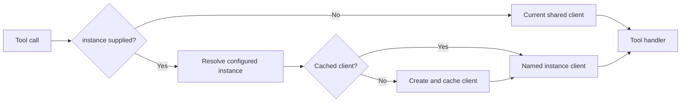

# Per-Call ServiceNow Instance Routing Design

**Date:** 2026-07-22

**Status:** Approved

## Problem

The MCP server currently keeps the selected ServiceNow environment on one mutable `ServiceNowClient`. `SN-Set-Instance` changes that shared client. Parallel workstreams can therefore redirect each other when they rely on the global selection.

The consolidated server defines 49 static ServiceNow tools. Fourteen already advertise an optional `instance` field, but their handlers still call the shared client and ignore the field. The remaining live tools do not expose a per-call selector.

## Goal

Every live ServiceNow operation can target a configured environment with an optional `instance` argument. Two concurrent calls with different explicit instance names must remain isolated.

## Non-Goals

- Remove `SN-Set-Instance` or change its sequential-workflow behavior.
- Add instance selection to local documentation tools.
- Return credentials or full instance configuration in tool results.
- Create a new client for every request.
- Make omitted `instance` calls independent of the shared current-instance selection.

## Approaches Considered

### Cached client per configured instance

Resolve explicit instance names to dedicated clients and cache them for the MCP server lifetime. Each request uses a call-scoped client reference.

This is the selected approach. It prevents cross-request mutation, reuses Axios and OAuth state, and keeps omitted calls backward compatible.

### Switch, call, and restore the shared client

Temporarily call `setInstance`, execute the operation, then restore the prior instance.

Rejected because overlapping asynchronous calls can observe the temporary state or restore in the wrong order. It preserves the race the feature must remove.

### Create a new client for every request

Construct a dedicated client whenever `instance` is present.

Rejected because it allocates avoidably and fragments OAuth and token state across calls.

## Architecture

### Tool schemas

The tool-list handler adds this property to every eligible tool schema:

```json
{
  "instance": {
    "type": "string",
    "description": "Configured ServiceNow instance name. Optional; uses the current instance when omitted."
  }
}
```

The property is injected through one schema transformation rather than copied into each tool definition. Existing `instance` definitions are normalized by the same transformation.

Excluded tools:

- `SN-Set-Instance`, because it already accepts `instance_name` and changes the sequential default.
- `SN-Get-Current-Instance`, because it reports that default.
- `SN-Docs-*`, because local documentation operations do not call ServiceNow.

### Client resolution

`createMcpServer` owns a per-server client cache keyed by configured instance name. The injected primary client remains the target for calls that omit `instance`.

For an explicit `instance`:

1. Resolve the configuration through `ConfigManager.getInstance`.
2. Return the cached client when present.
3. Otherwise create one client from the resolved URL, credentials, and `instanceToClientOptions` output.
4. Set the client's instance name and cache it.
5. Dispatch the tool handler through that call-scoped client.

The server accepts an injectable client factory so tests can provide isolated doubles without constructing live HTTP clients.

### Request flow



Every handler uses its request's resolved client. Explicit routing never calls `setInstance`.

## Concurrency Invariants

- A request with `instance: "dev"` always uses the dev client for its full handler execution.
- A simultaneous request with `instance: "prod"` uses a different client object.
- `SN-Set-Instance` cannot mutate cached explicit-instance clients.
- Repeated explicit calls to one instance reuse that instance's client.
- Calls that omit `instance` intentionally preserve current behavior and may follow `SN-Set-Instance`. Parallel workstreams must pass `instance` explicitly.

## Errors and Security

Unknown instance names fail before an outbound ServiceNow request. The existing `ConfigManager.getInstance` error identifies available names.

Tool results retain their current shape. Instance credentials never enter tool arguments, logs, or responses. The selector is only the non-secret configured instance name.

## Compatibility

- Existing calls without `instance` behave unchanged.
- `SN-Set-Instance` remains available and keeps its current response.
- The fourteen schemas that already expose `instance` begin honoring the documented contract.
- Existing authentication modes, including independent OAuth token state, remain supported.

## Verification

1. Tool-list contract: every eligible ServiceNow tool exposes optional `instance`; management and docs tools do not.
2. Default routing: omitted `instance` calls the injected primary client.
3. Explicit routing: named calls use the matching configured client.
4. Parallel isolation: simultaneous calls to two named instances stay on distinct clients.
5. Invalid selection: unknown names make no outbound request and return the existing MCP error form.
6. Cache behavior: repeated calls reuse the named client.
7. Compatibility: `SN-Set-Instance` still changes the sequential default.
8. Smoke test: invoke the MCP call handler concurrently with two mock configured instances and observe each request on its intended client.
