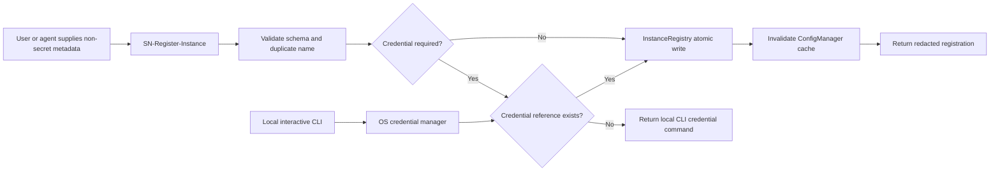

# ServiceNow Instance Registration Design

**Date:** 2026-07-23

**Status:** Approved

## Problem

Happy MCP supports multiple ServiceNow instances, but persistent configuration is tied to `config/servicenow-instances.json` inside the installed package. This is workable for a source checkout and brittle for global or `npx` installations. The environment-variable fallback supports only one credential set, so users often edit MCP host settings when changing environments.

The server can switch among configured instances with `SN-Set-Instance`, but it cannot create or maintain those registrations. A registration tool that accepts passwords or client secrets would move those secrets through model context, MCP arguments, host logs, and conversation history.

## Goals

- Store persistent instance registrations outside the npm installation directory.
- Let users add and maintain multiple named instances without repeatedly editing MCP host settings.
- Provide an MCP registration flow without exposing passwords or client secrets to the model or tool protocol.
- Keep one canonical registry shared by the CLI, stdio server, HTTP server, docs subsystem, and MCP tools.
- Make first-time registration available when the server has started in docs-only mode.
- Preserve `SN-Set-Instance` as the runtime selection mechanism.

## Non-Goals

- Accept a password or client secret in any MCP tool argument.
- Replace `SN-Set-Instance` with registration.
- Store basic-auth passwords or OAuth client secrets in the registry JSON.
- Treat the npm package directory as writable user storage.
- Add remote or team-synchronized secret storage.
- Expose credentials or credential values through list, get, log, or error output.

## Approaches Considered

### MCP tool writes complete registrations

`SN-Register-Instance` would accept the URL and credentials and write them to JSON.

Rejected because secrets could be retained by the model, MCP host, tool logging, or transcript storage. The convenience does not justify crossing that boundary.

### CLI-only instance management

An interactive local CLI would own all registry and credential operations.

This is secure and complete, but it leaves the MCP server unable to guide first-time setup, register non-secret metadata, or repair missing configuration from a conversation.

### Shared registry with CLI and safe MCP facade

A local registry service owns persistence and validation. The CLI captures secrets directly from the terminal and stores them in the OS credential manager. `SN-Register-Instance` accepts only non-secret metadata and references an existing credential profile.

This is the selected approach. It combines safe secret handling, discoverable MCP setup, and one implementation for all configuration consumers.

## Architecture

### User-owned registry

The canonical registry lives at the platform-appropriate user config location. The initial cross-platform contract is:

```text
~/.config/happy-platform-mcp/instances.json
```

`HAPPY_CONFIG_PATH` overrides this location. An absolute override is recommended for MCP host settings. The existing package-relative `config/servicenow-instances.json` remains a migration source, not the long-term writable destination.

One path resolver is shared by the instance registry and docs configuration. This removes the current mismatch where docs configuration honors `HAPPY_CONFIG_PATH` but `ConfigManager` ignores it.

### Registry schema

The JSON file stores non-secret configuration:

```json
{
  "version": 1,
  "instances": [
    {
      "name": "dev",
      "url": "https://dev.service-now.com",
      "authType": "basic",
      "username": "developer@example.com",
      "credentialRef": "keychain:instance/dev/basic",
      "default": true,
      "description": "Development instance"
    },
    {
      "name": "prod",
      "url": "https://prod.service-now.com",
      "authType": "oauth",
      "grantType": "client_credentials",
      "clientId": "service-client-id",
      "credentialRef": "keychain:instance/prod/client-secret",
      "default": false,
      "description": "Production instance"
    }
  ]
}
```

`username` and `clientId` are identifiers and remain in JSON. Passwords and client secrets are stored only in the OS credential manager. Authorization-code refresh tokens continue to use the existing keychain-backed token store.

### Registry service

A new `InstanceRegistry` owns:

- Path resolution and legacy-file migration.
- Schema parsing and validation.
- Atomic create, update, and remove operations.
- Default-instance uniqueness.
- File permission hardening where supported.
- Cache invalidation and reload notifications.
- Redacted list and get views.

Writes use a temporary sibling file followed by an atomic rename. A failed write must leave the prior registry intact. Mutations serialize within one process to prevent concurrent lost updates.

`ConfigManager` becomes a read-oriented facade over `InstanceRegistry`. Existing callers continue using `getInstance`, `getDefaultInstance`, `getInstanceOrDefault`, and `listInstances`.

### Credential store

A dedicated `InstanceCredentialStore` uses `@napi-rs/keyring` and shares the service name `happy-platform-mcp`. It stores basic-auth passwords and OAuth client secrets under stable account keys derived from instance name and credential type.

This store is separate from `KeychainTokenStore`, whose contract remains OAuth refresh-token persistence. Missing entries return a typed `CredentialNotFoundError`. Locked keychains, native-module failures, and permission errors fail loudly.

### CLI

The package binary gains interactive instance management:

```bash
happy-platform-mcp instance add
happy-platform-mcp instance list
happy-platform-mcp instance update dev
happy-platform-mcp instance test dev
happy-platform-mcp instance remove dev
happy-platform-mcp instance credential set dev --type password
```

Secret prompts disable terminal echo. Secrets are never accepted as command-line flags because process arguments may be observable. Non-interactive automation may supply a credential through a documented standard-input contract, not an argument.

The CLI and MCP tools call the same `InstanceRegistry`; neither edits JSON independently.

### MCP registration tool

`SN-Register-Instance` accepts only non-secret fields:

```json
{
  "name": "dev",
  "url": "https://dev.service-now.com",
  "authType": "basic",
  "username": "developer@example.com",
  "credentialRef": "keychain:instance/dev/basic",
  "description": "Development instance",
  "makeDefault": true
}
```

OAuth fields add `grantType`, `clientId`, `scope`, `authorizeUrl`, `tokenUrl`, `redirectPort`, and `callbackPath` where applicable. The schema does not define `password` or `clientSecret`; handlers also reject those keys if a client bypasses schema validation.

Registration is create-only by default. A duplicate name returns a conflict and points to the CLI update command. It must not silently replace an existing production registration.

When `credentialRef` does not exist, the tool does not persist a half-working basic-auth or client-credentials registration. It returns an exact local next action:

```bash
happy-platform-mcp instance credential set dev --type password
```

The tool chooses `password` or `client-secret` from the requested authentication mode. Credential references are deterministic from the instance name and type, so the CLI can create the keychain entry before the registration metadata exists.

Authorization Code with PKCE can register without a static secret when the configured OAuth application is a public client. Browser authorization still happens on first authenticated use.

### Docs-only availability

The current call handler rejects every non-doc tool in docs-only mode. `SN-Register-Instance` must be dispatched before that guard, alongside safe instance-list and registration-status operations. This allows a zero-credential installation to become configured.

A successful registration reloads the registry in memory. If it creates the first usable instance, the response explains that the current docs-only server process must initialize a ServiceNow client before live tools become available. The initial version may require a server restart rather than hot-swapping the complete MCP tool set; this behavior must be explicit.

## Data Flow



## Validation and Invariants

- Instance names are unique, trimmed, and limited to a conservative identifier format.
- URLs must be HTTPS except for explicit loopback test fixtures.
- Exactly zero or one registration is marked default; the first registration becomes default automatically.
- Basic auth requires `username` and an existing password credential reference.
- OAuth client credentials require `clientId` and an existing client-secret reference.
- OAuth password grant requires `clientId`, `username`, and both required credential references.
- Public Authorization Code with PKCE requires `clientId` but no static secret.
- Unknown input fields are rejected.
- Secret values never appear in JSON, logs, exceptions, MCP results, or list operations.

## Error Handling

Errors use stable codes and actionable messages:

- `INSTANCE_ALREADY_EXISTS`: choose another name or run the CLI update command.
- `INVALID_INSTANCE_CONFIG`: identify the invalid non-secret field without echoing input objects wholesale.
- `CREDENTIAL_NOT_FOUND`: provide the exact local credential command.
- `KEYCHAIN_UNAVAILABLE`: report the local keychain failure and make no registry change.
- `REGISTRY_WRITE_FAILED`: retain the prior file and report its resolved path.
- `REGISTRY_RELOAD_FAILED`: roll back the write when possible and preserve the prior in-memory snapshot.

No error path silently falls back to another credential or environment.

## Migration and Compatibility

1. Honor explicit `HAPPY_CONFIG_PATH` first.
2. Otherwise use the user-owned default path when it exists.
3. Otherwise read the legacy package-relative file.
4. Offer an explicit CLI migration that separates secrets into the keychain and writes the versioned registry.
5. Keep the singular `SERVICENOW_*` environment fallback for backward compatibility.

Legacy plaintext files remain readable during migration, but all new CLI and MCP writes use credential references. Migration never deletes the legacy file automatically.

`SN-Set-Instance`, per-call instance routing, OAuth refresh-token persistence, and current list results remain compatible.

## Verification

1. Path resolution tests cover explicit override, user default, legacy fallback, and missing configuration.
2. Registry tests cover atomic writes, duplicate conflicts, one-default enforcement, cache reload, rollback, and concurrent mutations.
3. Credential-store tests cover set/get/delete, missing entries, locked keychain, and strict redaction.
4. CLI tests use injected prompt and keychain adapters to verify secrets never enter arguments or output.
5. MCP contract tests prove the registration schema has no password or client-secret fields and rejects unknown secret keys.
6. Docs-only tests prove registration is callable without existing ServiceNow credentials.
7. Integration tests register two credential profiles, persist two instances, restart the configuration layer, and select each by name.
8. A smoke test starts with no registry, creates a credential locally, registers an instance through MCP, reloads configuration, and performs a redacted list operation.
